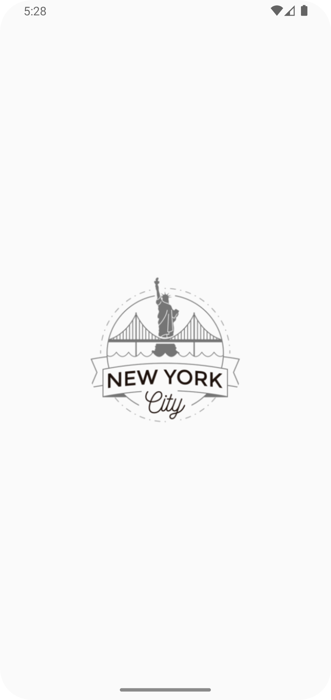
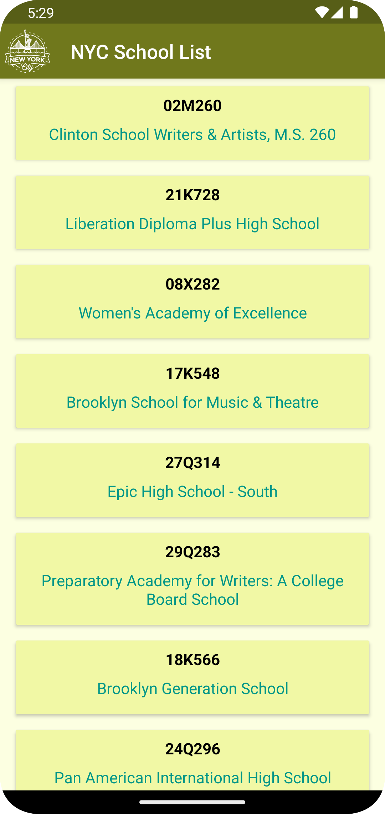

# NYC School List

NYC School list is an list of school in New York City. 

I have used Kotlin Multiplatform Mobile(KMM) .
I used Ktor for networking.
I used AppDatabase in commonMain.
I used JSON to fetch the data from API.
I used Swift in Xcode application.

  
  

